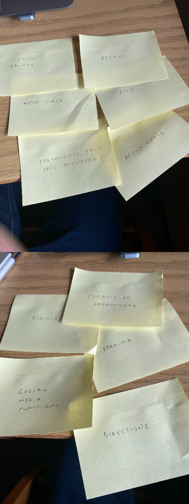
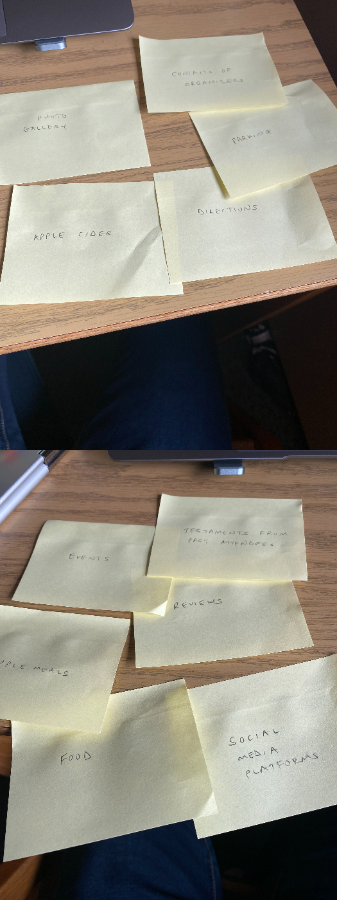
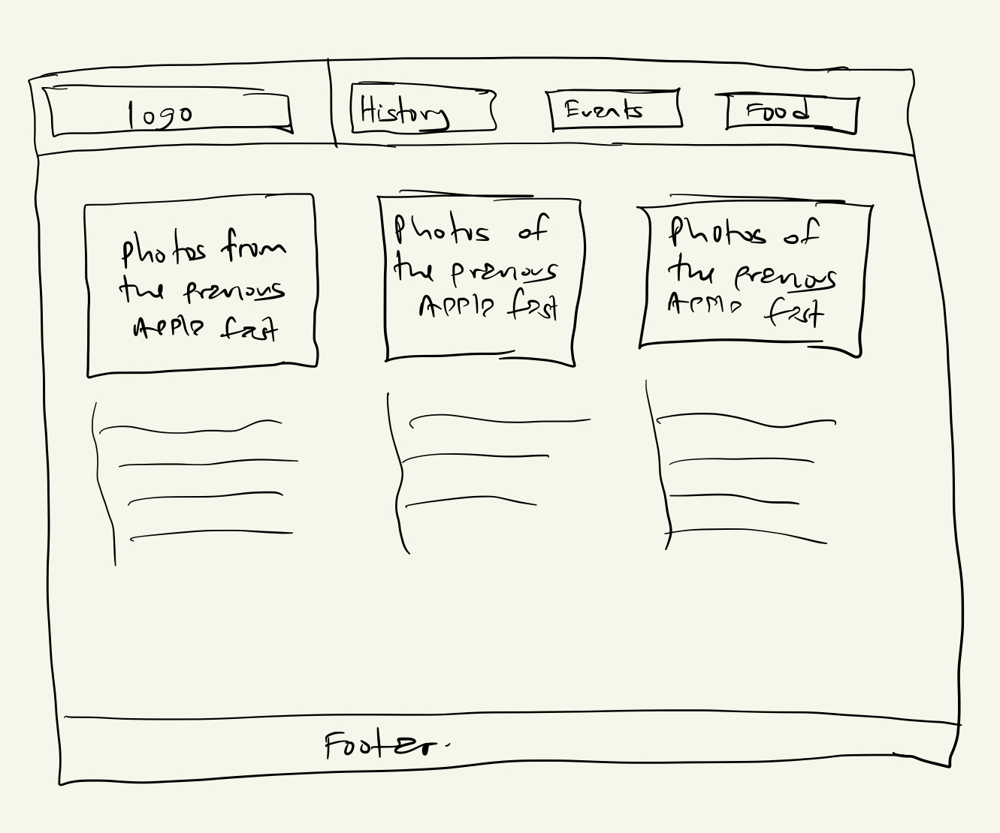
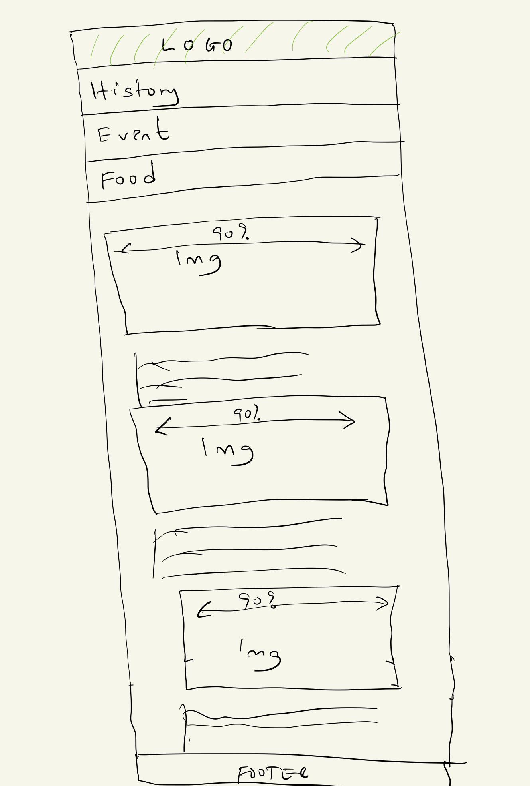
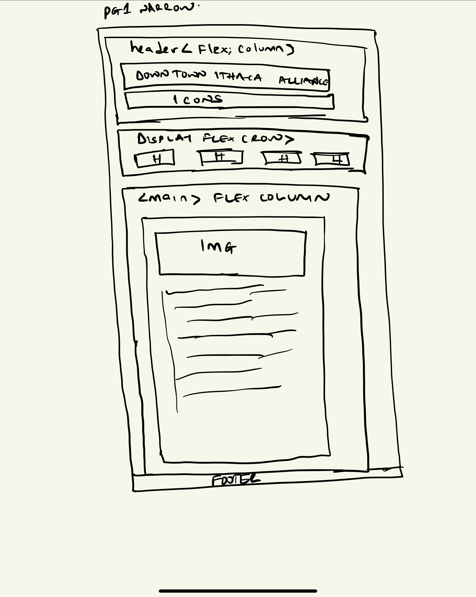
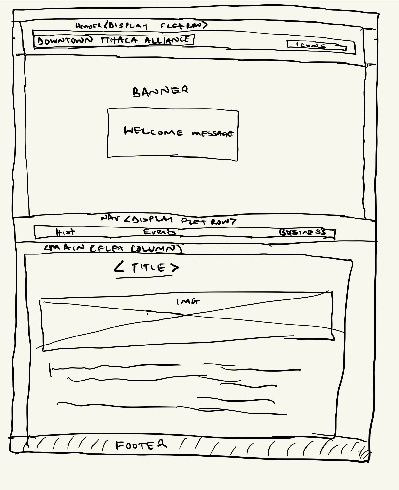
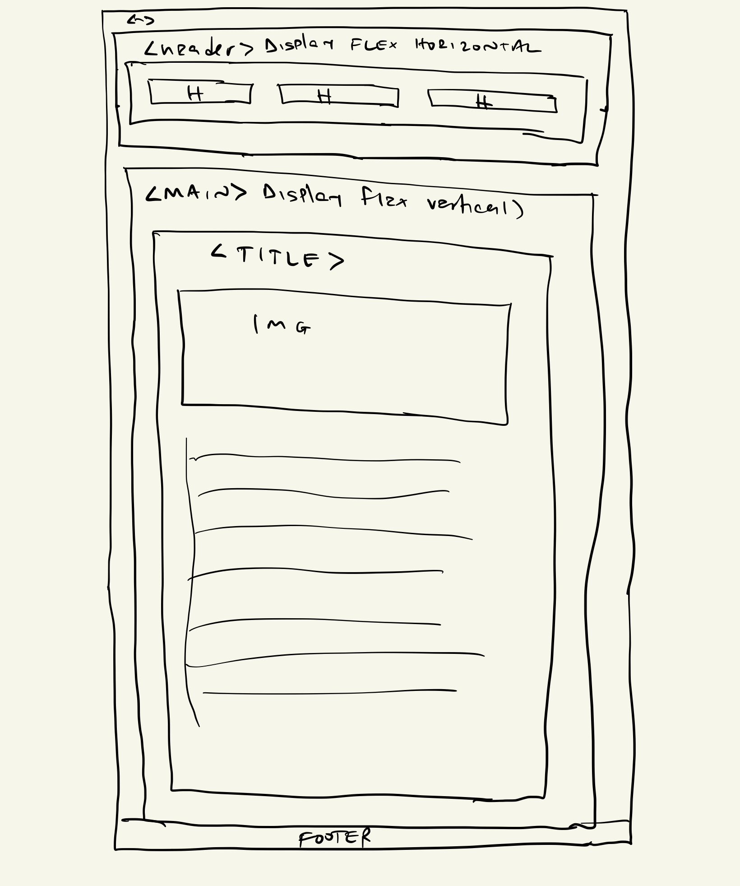

# Project 2: Design Journey

**For each milestone, complete only the sections that are labeled with that milestone.** Refine all sections before the final submission.

You are graded on your design process. If you later need to update your plan, **do not delete the original plan, leave it in place and append your new plan _below_ the original.** Then explain why you are changing your plan. Any time you update your plan, you're documenting your design process!

**Replace ALL _TODOs_ with your work.** (There should be no TODOs in the final submission.)

Be clear and concise in your writing. Bullets points are encouraged.

**Everything, including images, must be visible in _Markdown: Open Preview_.** If it's not visible in the Markdown preview, then we can't grade it. We also can't give you partial credit either. **Please make sure your design journey should is easy to read for the grader;** in Markdown preview the question _and_ answer should have a blank line between them.

## Understanding Users (Milestone 1)

**Make the case for your decisions using concepts from class, as well as other design principles, theories, examples, and cases from outside of class.**

You can use bullet points and lists, or full paragraphs, or a combo, whichever is appropriate. The writing should be solid draft quality but doesn't have to be fancy.

### User Interview Questions (Milestone 1)
> Plan the user interview which you'll use to identify the goals of your site's audience.
> You may use the interview template below and revise it as much as you desire.
> You are **required to author 3 of your own questions**.

**User Interview Briefing & Consent:** Hi, I am a student at Cornell University. I'm currently taking a class on web design and for a project, I am re-designing the website for Ithaca's Apple Harvest Festival. I'm trying to learn more about the people that might use this site. May I ask you a few questions? It will take about 10 minutes. You are free to quit at any time.

(These questions assume you are interviewing a festival attendee at the festival. If you didn't attend the festival, you may revise the questions and instead ask the participant to recall the last festival/event they attended. Do not ask them to speculate about visiting the Apple Harvest Festival. User speculation provides biased data.)

1. Please tell me a bit about yourself. You may omit any personal or private information.

2. What brought you to visit the Apple Harvest Festival today?

3. Before you came to the festival today, did you seek out any information about the festival before getting here?
3a. If yes, What information were you specifically looking for? Did you find it? How did you access that information?

4. When you arrived at the festival, did you seek out any information about the festival?
4a. If yes, What was that information? How did you obtain it?

5. Now that you're here participating in the festival, have you sought out information about the festival?
5a. If yes, where did you obtain the information from?

6. What are you looking forward to the most during the festival?
7. Have you ever participated in the apple festival before?
   7a. If yes, why are you back?
8. What is the biggest challenge you faced when you arrived here?

9. What haven't I asked you today that you think would be valuable for me to know?

**After the interview:** This was really helpful. Thank you so much for agreeing to speak with me today. Have a great day!

### Interview Notes (Milestone 1)
> Interview at least 3 people from your audience. Take notes and include those notes here. Make sure to include a brief description of each interviewee.
> **Copy the interview questions above into each interviewee section below.**
> Take notes for each participant inline with the questions.

**Interviewee 1:**
My first interviewee was Mr. John Mcnulty, an NYU Alumni. He came all the way from NYC to have the coveted honor of attending the apple festival!

1. Please tell me a bit about yourself. You may omit any personal or private information.  Mr. Mcnulty claimed to work for a NYC-based company that specializes in distributing drinks, and he was assigned to assess the Ithaca Apple Cider and negotiate contracts with regional producers. He added that he enjoys meeting new people and traveling.

2. What brought you to visit the Apple Harvest Festival today? He corroborated with what he had said before; the corporation had sent him to assess the quality of the cider made nearby and possibly make business deals with the producers.

3. Before you came to the festival today, did you seek out any information about the festival before getting here? Yes
3a. If yes, What information were you specifically looking for? Did you find it? How did you access that information? He stated that he was interested in hearing from anyone who had tried the apple cider made in Ithaca about their experiences and opinions. To his disappointment, he found very little information online, and the only trustworthy response he found came from a friend who attended Cornell and had had the apple cider.

4. When you arrived at the festival, did you seek out any information about the festival? No. He indicated that due to his weariness from the drive to Ithaca, he went right to his hotel and rested.
4a. If yes, What was that information? How did you obtain it?

5. Now that you're here participating in the festival, have you sought out information about the festival? Yes
5a. If yes, where did you obtain the information from? He claimed to have gone to neighborhood bars and talked to regulars about the festival's history and the reasons the Ithaca community holds it in such high regard. Additionally, he discussed the festival with his Ithaca-born Uber driver.
6. What are you looking forward to the most during the festival? He expressed excitement about doing business with suppliers and seeing what the community thinks of locally produced cider as opposed to imported cider. When Ithaca cider enters the mainstream market, he claimed that this will aid the company's marketing efforts.
7. Have you ever participated in the apple festival before? No
7a. If yes, why are you back?
8. What is the biggest challenge you faced when you arrived here? Mr John Mcnulty expressed dissapointment on how he had to struggle locating info about the festival's planned events.
9. What haven't I asked you today that you think would be valuable for me to know? Mr Mcnulty spoke so vibrantly about how the apple ciders at Downtown are underated.

**Interviewee 2:**
My second intervewee was Jennifer Jones

1. Please tell me a bit about yourself. You may omit any personal or private information. Jennifer told me that she is a senior at Ithaca college majoring in Biology

2. What brought you to visit the Apple Harvest Festival today? Jennifer asserted that she had come to sample the festival's wide variety eciting events including the pre Haloween march.

3. Before you came to the festival today, did you seek out any information about the festival before getting here? No. She is a local thus did not see the need seek information about the festival.
3a. If yes, What information were you specifically looking for? Did you find it? How did you access that information?

4. When you arrived at the festival, did you seek out any information about the festival? Yes.
4a. If yes, What was that information? How did you obtain it? She told that me she went to Ithaca Commons and talked to the events organizers about the planned events.

5. Now that you're here participating in the festival, have you sought out information about the festival? No. She said that she had been the one introducing her pals to the festival's history and giving them tours of the area.
5a. If yes, where did you obtain the information from?

6. What are you looking forward to the most during the festival? Jennifer expressed excitement for the apple festival gift basket competition. She sees it as a witty approach to simultaneously demonstrate humanity and have fun.
7. Have you ever participated in the apple festival before? Yes.
   7a. If yes, why are you back? Jenniffer said the fun packed activities are like no other thing she has experienced before. She is particularly interested in the events that are taking place at the shops in Ithaca.
8. What is the biggest challenge you faced when you arrived here? Ms. Jennifer lamented the fact that the majority of taxi hailing apps were either inaccurate or completely unavailable.
9. What haven't I asked you today that you think would be valuable for me to know? Ms Jonnes expressed her joy about how much Ithaca has not changed (in a good way) since she started college and it is integral that it stays so, away from the hustle and bustle of NYC.

**Interviewee 3:**
My next interviewee is Jeff Kangacha.

1. Please tell me a bit about yourself. You may omit any personal or private information. Jeff is a junior at Cornell double majoring in IS and International Agriculture.

2. What brought you to visit the Apple Harvest Festival today? In addition to the positive energy the apple festival generates, Jeff revealed that he is looking for opportunities to use his expertise in digital marketing to increase apple festival sales. He wanted to experience American celebrations because he is also an international student from Kenya.

3. Before you came to the festival today, did you seek out any information about the festival before getting here? Yes.
3a. If yes, What information were you specifically looking for? Did you find it? How did you access that information? Jeff was curious as to how the festival would differ from past years. His peers who had been present for the festival the previous few years were his primary source of information. He also looked through the website for the apple festival, but the data he found there was redundant.

4. When you arrived at the festival, did you seek out any information about the festival? Jeff did not seek any information about the apple festival.
4a. If yes, What was that information? How did you obtain it?

5. Now that you're here participating in the festival, have you sought out information about the festival? Yes
5a. If yes, where did you obtain the information from? According to Jeff, he was with pals who had previously attended the festival. His pals gave him all the information about the apple festival that he need.

6. What are you looking forward to the most during the festival? Jeff said he is looking forward to tasting the apple cider. It would be his first time tasting it.
7. Have you ever participated in the apple festival before? Jeff has never participated in the apple festival before.
   7a. If yes, why are you back? Jeff was attending the festival for the first time.

8. What is the biggest challenge you faced when you arrived here? Jeff lamented about the lack of tour guides.

9. What haven't I asked you today that you think would be valuable for me to know? Jeff told me that it would be cool if the website I'm building has a more 'festival like' homepage more than just apples.

### Goals (Milestone 1)
> Analyze your audience's goals from your notes above.
> List each goal below. There is no specific number of goals required for this, but you need enough to do the job (Hint: It's more than 1 and probably more than 2).

Goal 1: Get a sense of festivitivity when they visit the apple harvest festival website.
Goal 2: Learn about the festival's past and what it represents to the community.
Goal 3: Understand the cultural heritage of the festival.
Goal 4: Get a list of all the day's planned events.

- **Design Ideas and Choices** _How will you meet those goals in your design?_
  - All of the aforementioned objectives are the result of the current apple fest website's inadequate level of information. To make my website more content worthy for my audience, I will have tabs in my design devoted to the objectives they require i.e history, events and business.
- **Rationale & Additional Notes** _Justify your decisions; additional notes._
  - The website for the current apple festival is lacking. We have very few events posted, and the generic content includes things like event time slots. Additionally, we don't know what previous festival goers had to say or why the locals place such a high value on it. Therefore, the website comes out as somewhat generic because it lacks such fundamental information, yet its potential is limitless.

Goal 2: Anyone visiting the website should learn a little about the festival's history.

- **Design Ideas and Choices** _How will you meet those goals in your design?_
  - I'll include a section explaining the beginnings of the apple festival and the goals it pursues annually. Additionally, including images of prior apple festivals would help put the current celebration in perspective.
- **Rationale & Additional Notes** _Justify your decisions; additional notes._
  - People like Jeff Kangacha, who are overseas students, should be able to learn more from the apple festival website than just the fact that it is held annually. As research has shown, an event's attendance is boosted when people feel a feeling of patriotic pride for it. It would also be a great chance for the event to market itself as a long-standing tradition.

Goal 3: Visitors to the event should be able to identify the popular events happening at the festival.

- Jennifer needed to be physically present at the festival to find out what main events were happening, which disappointed me. Every culture revolves around heritage, therefore the apple festival website should definitely have a section devoted to it. I'll take a close look at this when re-designing the website.

### Audience (Milestone 1)
> Briefly explain your site's audience.
> Be specific and justify why this audience is a **cohesive** group with regard to the Ithaca Apple Harvest Festival.

- My site's audience will be anyone seeking information about the Ithaca apple festival or  planning on attending the festival. This audience is a cohesive group since they all have one thing in common; They're all seeking information abut the apple festival and that is what I will seek to provide. when re-desining the website.

## Festival/Event Website Design Exploration (Milestone 1)

Identify three festival or event websites (preferably static websites) that exist today on the web. You will be drawing inspiration from these sites for your own site; please select websites that are similar to the website you wish to create.

Include two screenshots of the home page for each site: narrow and wide.

**We'll refer to these are your "example websites."**

1. <https://onevibeafrica.org/campaign/kisumu-festival/>

     

    

2. <https://www.riocarnaval.org/brazil-carnival/carnaval-brazil>

    

    

3. <https://americandancefestival.org/>

    

    

### Festival/Event Website 1 Review (Milestone 1)
> Review the website you identified above. (1 paragraph)
> In your review, include a discussion common design patterns in the site.

- The website uses many images, which improves the aesthetic appeal of the site. Additionally, it is simple to navigate, and the image choices portray a lively environment where everyone would adore to be. Additionally, it promotes mainstream musicians, sending the notion that this is a major deal. However, the website's written content, which in this case is more crucial, is obscured by the heavy reliance on graphics. The nav bar being at the top and the logo being on the top left of the navbar are typical design patterns. The navbar also turns into a menu when the view port is small, which is another prevalent design pattern.

### Festival/Event Website 2 Review (Milestone 1)
> Review the website you identified above. (1 paragraph)
> In your review, include a discussion common design patterns in the site.

- The website for the Brazilian event uses a lot of text, which is both a plus and a minus. The website has a lot of information about what actually happens during the event because to its abundance of writing, however this detracts from its appearance. Collapsible navbar menus and responsive images, as opposed to fixed width graphics, are prevalent web design patterns.

### Festival/Event Website 3 Review (Milestone 1)
> Review the website you identified above. (1 paragraph)
> In your review, include a discussion common design patterns in the site.

- The website for the American Dance Festival balances text and visuals. Each falls short of the other. This is a fantastic option because there is harmony between the website's written and visual content. The primary heading often disappears when the material is opened on a narrow screen and reappears on broader screens, with the navigation bar serving as the main exception.

## Content Planning (Milestone 1)

Plan your site's content.

### Your Site's Planned Content (Milestone 1)
> List **all** the content you plan to include your personal website.
> You should list all types of content you planned to include (i.e. text, photos, images, etc.)

- Text - The history of the festival, what is on offer on the website, why the festival is well regarded by the locals, upcoming concerts, etc.
- pictures of the events and the products they sell.
- Links to information about the event, such as sites where it has been featured, etc.

### Content Justification (Milestone 1)
> Explain (about a paragraph) why this content is the right content for your site's audience and how the content addresses their goals.

- In order to save the audience from reading lengthy passages of text that may be summarized in a single image, the images and photos will be for aesthetic and informative purposes only. The The links will be used to provide additional festival information that is not available on our website The text will serve as a description of the festival's events and its designated time slot.

## Information Architecture (Milestone 1)

### Content Organization (Milestone 1)
> Document your **iterations** of card sorting here. You must have at least 2 iterations of card sorting.
> Include photographic evidence of each iteration of card sorting **and** description of your thought process for each iteration.
> Please physically sort cards; please don't try and do this digitally.

- For the iterations above, I grouped contents related to direction together i.e events and social media so that the user can keep track of what is happening in real time. I also grouped the photo gallery, reviews, and food together as they are drectly related. When one wants to order food or try out a new food, it is imperative that they will want to know what others think about it.

- For the iteration above, I grouped all contents that would need reviews together i.e food and events along with the accompanying social media platforms to keep track of what is happening in real time.

### Final Content Organization (Milestone 1)
> Which iteration of card sorting will you use for your website?

- I will use iteration 1.

> Explain how the final organization of content is appropriate for your site's audiences.

- It was very evident from the interviews I conducted that the website needed to include more information on the history of the festival and what previous attendees had to say about their experiences. In light of this, the site is made to be very user-friendly by grouping the content connected to directions and the content linked to reviews.

### Navigation (Milestone 1)
> Please list the pages you will include in your website's navigation.

- History
- Events
- Business

> Explain why the names of these pages make sense for your site's audience.

- From the interviews I conducted, it was crystal clear that these are the main goals of anyone visiting the site. By having the pages named as what the audience would expect to find, navigating the site becomes easier for even a five year old.

## Visual Theme (Milestone 1)
> Discuss several (more than two) ideas about styling your site's theme. Explain why the theme ideas are appropriate for your target audiences. Note the theme you selected for your site and why it's appropriate for the audience and their goals.

- White background and black text. Having this combination of colors creates  rather professional look and the content will be easy to read. This also conveys positive emotions. The contarast between the two colors also makes the content easy to read.

- Yellow text and royal blue background. Due to the happy vibes prevalent in the website, using this combination will help convey a wild spirit. The colors are also calming and kind to the reader's eyes.

- White navigation text with a golden rod background. Dark green makes up the body, with black text set on a white background. The differences in contrast and the color combination  will blend perfectly and will not hurt the  readers' eyes.

## Design (Milestone 1)

Document your site's layout.

### Layout Exploration (Milestone 1)
> Iterate on your site's design through sketching.
> Sketch both the narrow and wide versions of the site.
> Here you are just exploring your layout ideas. You don't need to sketch every page.
> Provide an explanation for each sketch explaining the idea and the design patterns you are leveraging.

- For this layout, I sketched the layout of my site had photos of the past events to be the main thing on the front page of the website. Beneath each picture, there are accompanying texts that give content to what is happening on the images. THis layout uses both visual and textual evidences to communicate to the audience thus it is very intuitive.

- For the narrow screen layout, the content stack up on each other and the images occupy almost 1000vw thus reducing the amount of white space.

### Final Design (Milestone 1)
> Include the final sketches for each of your pages.
> The sketches must include enough detail that another 1300 student could implement them.
> Provide an explanation for each sketch.

**Narrow (Mobile) Design:**

)

)

)

- I decided to remove the side bar from the small sketches in order to better utilize the space. The site will be simple to use because all the contents will be accessible on desktop and mobile devices thanks to the way the contents are stacked on top of one another.

**Wide (Wide) Design:**

- To make the website simple to navigate on large screen displays, I decided to use the same layout for all of the pages. This layout makes it simple to find content and employs text and graphics approximately equally, so no content is obscured.

### Design Rationale (Milestone 1)
> Explain why your design is appropriate for your audience.
> Specially, why does your content organization, navigation, and site design/layout meet the goals of your users?
> How did you employ **design patterns** to improve the familiarity of the site for your audience?

- The layout I choose incorporates both visual and textual elements, making it aesthetically pleasant. The website will undoubtedly be very simple to navigate thanks to the content organization, which took into account what the users requested from the interviews. I also used conventional design strategies, such as placing the navigation bar to the top or side of the page. Additionally, the text is aligned to the left, which is a common design practice.

## User Testing (Final Submission)

### User Testing Tasks (Final Submission)
> Plan out your user testing tasks before doing your user testing.
> These must be actual user testing tasks.
> **Tasks are not questions!**

1. Locate the historical background of the festival.

2. Find a list of all planned events.
3. Find a list of all the business opportunities at the Ithaca Festival

### Participant 1 (Final Submission)
> Using your notes from above, describe your user by answering the questions below.

1. Who is your user, e.g., where does the user come from, what is the user's job, characteristics, etc.?

    - My first user is David Berk. He owns a local phone repair shop at Ithaca DownTown

2. Does the user belong to your audience of the site?

    > If “No”, what’s your strategy of associating the user test results to your audience’s needs and wants? How can your re-design choices based on the user tests make a better fit for the audience?

    - Yes.

### Participant 1 -- Testing Notes (Final Submission)
> When conducting user testing, you should take notes during the test.

1. Locate the historical background of the festival.

   - The user looks confused on opening the site's homepage. He starts by clicking on the social media icons on the top navigation  panel. Seeing they are not leading him where he wants, he closes the site and says he cannot find it. Task failed.

2. Find a list of all planned events.

   - The user opens the site's homepage and this time scrolls down, where he finds the navigation panel. He clicks on events and finds all the events listed. Task succeeded.

3. Find a list of all the business opportunities at the Ithaca Festival

   - The user seems confident this time, he scrolls down on the homepage and clicks on the business tab which takes him to the businesses at the Ithaca apple festival. Test passed.

### Participant 2 (Final Submission)
> Using your notes from above, describe your user by answering the questions below.

1. Who is your user, e.g., where does the user come from, what is the user's job, characteristics, etc.?

    - My user is called Swiny Okath, a freshman at Ithaca college and a frequent attendee of the apple festival. Test passed.

2. Does the user belong to your audience of the site?

    > If “No”, what’s your strategy of associating the user test results to your audience’s needs and wants? How can your re-design choices based on the user tests make a better fit for the audience?

    - Yes

### Participant 2 -- Testing Notes (Final Submission)
> When conducting user testing, you should take notes during the test.

1. Locate the historical background of the festival.

- The user opens the site's homepage and clicks on the downward facing arrrow which takes her to the navigation panel. After some hesitation, she clicks on the history tab which takes her to the history of the festival. Task success.

2. Find a list of all planned events.

- The user clicks on the arrow on the homepage which lands  her on the site's navigation. She then clicked the Events tab which takes her to the events at the festival. Task succeeded.

3. Find a list of all the business opportunities at the Ithaca Festival

- The user clicks on the arrow on the homepage which lands  her on the site's navigation. She proceeds to click on the business tab which takes her to the business page of the website. Task succeded.

### Participant 3 (Final Submission)
> Using your notes from above, describe your user by answering the questions below.

1. Who is your user, e.g., where does the user come from, what is the user's job, characteristics, etc.?

   - My user is Solomon Baik, my roomate who also attended the apple festival.

2. Does the user belong to your audience of the site?

    > If “No”, what’s your strategy of associating the user test results to your audience’s needs and wants? How can your re-design choices based on the user tests make a better fit for the audience?

    - Yes

### Participant 3 -- Testing Notes (Final Submission)
> When conducting user testing, you should take notes during the test.

1. Locate the historical background of the festival.

   - The user starts by clicking on the social media icons on the top navigation  panel. He then scrolls down and finds the navigation pane with a list of the webpages. He then clicks on history tab which leads hm to th historical account of the festival. Task passed.

2. Find a list of all planned events.

   - The user opens the site's homepage and this time scrolls down, where he finds the navigation panel. He clicks on events and finds all the events listed. Task passed.

3. Find a list of all the business opportunities at the Ithaca Festival

   - He scrolls down on the homepage and clicks on the business tab which takes him to the businesses at the Ithaca apple festival. Test passed.

### Potential Changes Based on User Testing (Final Submission)
> What changes would you make to your design based on user testing?
> Note: You are not required to change your design. Simply tell  us what you would change.

- I would have all my navigation panels at the top of the page since two users seeemed to think that the nsvigstion psnel at the top was the one they should use for navigation.

## Rationale (Final Submission)

**This rationale should be polished writing:** one you might submit as a report to a client or boss to help explain the project and convince them you did a good job. You'll be surprised how much writing and communicating you need to do about projects and choices on internships and jobs; practice that here.

It should be a comprehensive, complete story of the project. You might find that each section runs about a paragraph. Sketches can often help tell the story of your design.

Your rationale should be a polished version of the earlier explanations.

### Audience (Final Submission)
> A complete and polished description of the intended audience(s) for your website.

-Anyone looking to learn more about the Ithaca Apple Harvest Festival is the website's target audience. Additionally, I'm aiming to draw event organizers who are unsure of when to reserve performance spaces. By listing the events on my website, they can quickly see at what times certain areas are not booked before committing to contacting the space owners to reserve. Finally, the website will be a valuable resource for anyone looking to conduct business at the Ithaca Festival because it has a listing of all the business opportunities available.

### Audience Goals
> Explain how your site's design addresses the goals of the audience.

- From the interviews I conducted, it was evident that my site's audience needed three things in particular: events, possible business opportunities, and the festival's historical background. My site is strongly focused on these three things thus addresses the goals of my intended audience.

### Visual Design (Final Submission)
> An explanation of how the final design is appropriate for your audience.
> Include design patterns in your rationale.

- From the themes goldenrod theme to the clear contrast between backgrounds and text, my site is kind to the users' eyes. I also named my navigation bar using the same name as the content thus saves the user a lot of time when trying to locate content. Additionally, I used common design principles to make the site easier to navigate, such as placing the navigation bar and page titles at the top of the webpages.

### Self-Reflection (Final Submission)
> Take some time here to reflect on how much you've learned since you started this class. It's often easy to ignore our own progress. Take a moment and think about your accomplishments in this class. Hopefully you'll recognize that you've accomplished a lot and that you should be very proud of those accomplishments!

- It has been fascinating to learn and apply media querries  which can make a site adapt to the size of the browser. I can't wait to learn more!

## Grading (Final Submission)

### Collaborators
> List any persons you collaborated with on this project.

- None

### Reference Resources
> Please cite any external resources you referenced in the creation of your project.
> (i.e. W3Schools, StackOverflow, Mozilla, etc.)

- I used W3Schools documentation to learn how I can animate my navigation images.
